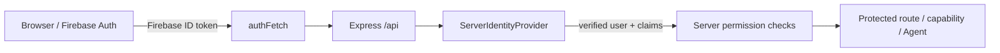
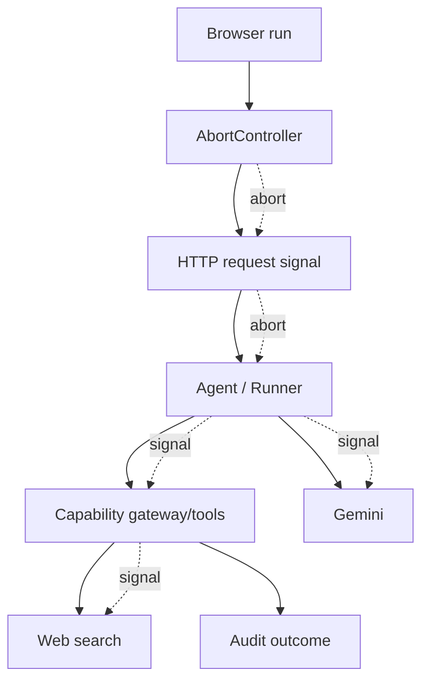

# Modular Agent Webapp v14 — Final Architecture Status

This document describes the architecture implemented in the locked v14 source. It is a description of current code, not a roadmap.

## 1. Frontend architecture

The browser application is React/Vite. `src/App.tsx`, the TanStack router, application shell, domain modules, Zustand stores, and Agent UI compose the frontend. Firebase Web Auth supplies the signed-in browser identity; protected server calls use `authFetch`, which attaches the Firebase ID token.

The AI settings store persists only non-secret configuration/metadata needed by the browser. Saved credential secrets are never returned by the credential-list API and are not persisted in the Zustand storage slice.

## 2. Auth flow

`/api/health` and `/api/log-error` are intentional public API exceptions. Other `/api/*` routes pass through server identity verification. Agent `stateDelta` identity fields (`user`, `userId`, `email`, `roles`, `permissions`, `admin`, `confirmed`) are stripped before the verified identity is inserted into execution context.

## 3. AI Settings flow

`shared/contracts/ai.ts` defines the canonical strict `AIConfigSchema`:

- `agentProvider`
- `agentModel`
- `credentialId`
- `autoRotate`
- `memoryEnabled`
- `webSearchEnabled`

Agent provider is currently the literal Google provider. `AdkRuntimeProvider` reads the hydrated AI store and sends this canonical configuration to `/api/agent/chat`. Server-side schema parsing rejects invalid configuration. The client refuses to send Agent requests while AI settings are not hydrated.

## 4. RootAgent construction

`RootAgent.buildAgent()` receives a server-built `ExecutionContext`. It:

1. requires an authenticated non-guest user;
2. parses canonical AI configuration;
3. enforces the Google/Gemini Agent boundary;
4. asks `ServerCapabilityRegistry` for capabilities permitted by module state and user permissions;
5. filters Memory/Search capabilities according to `memoryEnabled` / `webSearchEnabled`;
6. wraps capabilities with `CapabilityToolAdapter`;
7. resolves the selected credential or personal rotation pool;
8. constructs the Gemini-backed ADK `LlmAgent`.

## 5. Credential resolution

`CredentialService` owns credential metadata/secret lifecycle. Personal credentials are scoped under the authenticated user and checked for ownership, provider match, and lifecycle status before use.

- `credentialId = system` resolves only the Google System credential backed by server-only `GEMINI_API_KEY`.
- Personal credentials resolve from Firestore and are unprotected server-side immediately before use.
- Personal credentials do not silently fall back to System Key.
- Rotation candidates remain personal, same-user, same-provider, active, and deterministically ordered.

`credentialSecretProtector.ts` implements versioned AES-256-GCM protection with a random 12-byte IV and authentication tag. The master key is loaded from server environment and is not stored with ciphertext.

## 6. Search capability

`system.web.search` is a custom server capability. `WebSearchService` resolves the selected credential server-side, performs a separate Google GenAI request with `{ googleSearch: {} }`, and maps grounding metadata into source entries and search queries. Search can be disabled by `webSearchEnabled`.

## 7. Capability Registry

`ServerCapabilityRegistry` stores capability descriptors and is the policy boundary for discovery/execution. It validates input, refreshes durable module state, rejects disabled/unverifiable modules, checks server-side permissions, applies high-risk confirmation requirements, observes cancellation, and invokes only registered capability implementations.

Tasks/Memory/Search system capabilities are registered in `systemCapabilities.ts` and operate through server services, not browser Firestore CRUD.

## 8. Central Execution Gateway

All Agent tool execution and REST capability execution converge on `CapabilityExecutionService`. The gateway:

- creates a durable pre-execution audit record;
- forces `confirmed=false` on caller context;
- performs high-risk preflight;
- prepares/consumes a server-side confirmation challenge when required;
- executes via `ServerCapabilityRegistry`;
- finalizes audit status without replaying an already-completed side effect if audit finalization later fails.

## 9. HITL

High-risk capability confirmation uses `CapabilityConfirmationService`. Challenges store user ID, capability ID, input hash, expiry, and consume state in Firestore. Consumption occurs in a Firestore transaction so concurrent replay cannot consume the same challenge twice. Client `confirmed:true` is not an authorization primitive.

## 10. Tasks / Memory

`UserDataService` owns Firestore persistence for `agent_tasks` and `agent_memories`.

- Tasks are scoped by `userId` and protected by `tasks.*` permissions.
- Memories are scoped by `userId` and protected by `memory.*` permissions.
- Agent memory creation defaults to `pending`; `system.memory.query` forces `status=approved`.
- Query/category/status semantics are applied server-side.

Firestore Rules deny direct browser reads/writes to server-authoritative collections; Admin SDK access is governed by IAM rather than Rules.

## 11. Session persistence

`FirestoreSessionService` stores session metadata under the app/user/session hierarchy and events in a per-session events subcollection. This avoids rewriting a growing events array and avoids a single large session document. Server session IDs are user-scoped and client IDs are validated to a bounded path-safe format.

## 12. Temporary sessions

When `temporaryMode=true`, the server uses a separate in-memory session service. Temporary sessions are not returned by persistent History APIs. The client also avoids local browser persistence for temporary mode.

## 13. Session fallback / recovery

Non-production Firestore permission failures may use a process-local fallback. A fallback session is pinned by `(appName, userId, sessionId)` so recovery of Firestore does not silently replace its active state. Persistent and pinned-memory sessions are merged for History, deduplicated by identity, sorted by last update time, then paginated. Pinned memory sessions remain authoritative for their active lifetime and are unpinned on deletion.

Production does not instantiate the insecure process-memory fallback; persistence failures are fail-closed/observable.

## 14. Audit

`AuditService` stores durable Firestore records with sanitized/redacted summaries. Capability execution logs a pending record before execution and finalizes outcome/duration afterward. Audit listing applies tenant filtering before ordering/cursor/limit. Module toggle writes module state and audit in one Firestore transaction.

## 15. Module configuration

Core module metadata is seeded by `serverModuleCatalog`. `StorageEngine` hydrates/shared-persisted `module_settings` from Firestore. Capability discovery and execution perform read-through refresh so another instance cannot authorize from stale local module state. If a disableable module's durable state cannot be verified, execution fails closed.

## 16. Firestore usage

Major server-side Firestore data includes:

- tasks and memories;
- user personal credential metadata/protected secret payloads;
- Agent sessions/events;
- capability confirmations;
- audit logs;
- shared module settings;
- read-only runtime health probe documents/queries.

The Firebase Admin SDK is initialized with Application Default Credentials and configured project/database IDs. Admin access is controlled by Google Cloud IAM/ADC and bypasses client Security Rules.

## 17. Security boundaries

- **Identity:** verified Firebase identity on the server.
- **Authorization:** permission/ownership/module checks server-side.
- **Secrets:** personal API keys encrypted at rest; System key server-only; browser receives metadata only.
- **HITL:** server-issued confirmation challenge; no trusted client boolean.
- **Audit:** durable Firestore audit with redaction and tenant filtering.
- **Firestore:** browser Rules are deny-by-default for server-owned data; Admin SDK uses IAM.
- **Runtime:** CSP, request limits, user/IP rate limiting, fatal process termination, safe error summaries.

## 18. Error / cancellation flow

Cancellation is distinguished from ordinary failure and is audited as cancelled where the central gateway is involved. Completed side effects are not represented as rolled back. Provider errors are sanitized/classified; explicit HTTP status has precedence for credential-rotation decisions.
