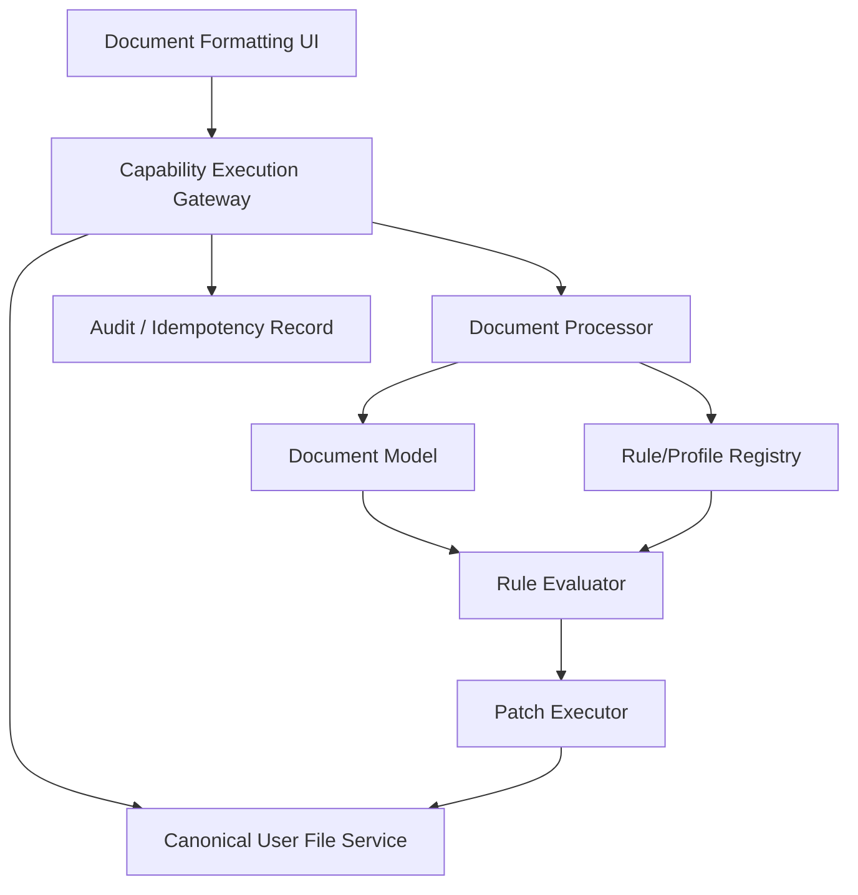

# Báo cáo rà soát và thiết kế module Định dạng văn bản

**Ngày lập:** 03/10/2026  
**Trạng thái:** Thiết kế đề xuất; chưa mở workstream triển khai, chưa sửa runtime module.  
**Phạm vi:** Module chuẩn hoá thể thức/trình bày DOCX cho Công ty Hoa tiêu hàng hải miền Bắc.

## 1. Quyết định nền tảng

Hai repository sau là **baseline nghiệp vụ đã được người dùng duyệt** cho nội dung Nghị định 30 và mô hình chuẩn hoá. Báo cáo này không đối chiếu hoặc phản biện nội dung của chúng với văn bản gốc.

1. [chuan-hoa-van-ban-nghi-dinh-30](https://github.com/quanggiaphthh/chuan-hoa-van-ban-nghi-dinh-30)
2. [huong-dan-dinh-dang-van-ban-nd30](https://github.com/quanggiaphthh/huong-dan-dinh-dang-van-ban-nd30)

Module không phải công cụ soạn nội dung hoặc Word editor. Nhiệm vụ của nó là đọc một DOCX đã có nội dung, nhận diện cấu trúc và loại văn bản, kiểm tra thành phần theo rule/profile đã phát hành, áp các thay đổi định dạng an toàn lên bản sao, rồi xuất DOCX và báo cáo kết quả.

## 2. Kết luận rà soát

Hướng kiến trúc của repository chuẩn hoá phù hợp với module cần xây: `Source Registry → Atomic Rules → Applicability Resolver → Rule Pack → Organization Profile → Document Engine → Validator → Safe Patch`.

Các điểm phải được giữ làm nguyên tắc thiết kế:

- Rule pháp lý/quy định, lựa chọn nội bộ của Công ty và khuyến nghị chất lượng là ba lớp riêng.
- Mỗi rule là một yêu cầu nguyên tử, có phạm vi, thời điểm, điều kiện áp dụng, nguồn và chính sách kiểm tra/sửa.
- Không áp rule từ tên tệp hoặc tên loại văn bản đơn thuần; phải dùng ngữ cảnh phát hành và trạng thái nhận diện.
- `NOT_EVALUATED`, `NEEDS_REVIEW` và `PASS` là ba trạng thái khác nhau.
- Chỉ sửa thuộc tính định dạng cục bộ có mục tiêu và bằng chứng rõ ràng. Không tự viết lại nội dung, căn cứ, thẩm quyền, chữ ký hoặc ý nghĩa của văn bản.
- DOCX nguồn luôn giữ nguyên; mọi áp dụng tạo ra một DOCX đầu ra mới, có audit trail và được kiểm tra lại.

Repository handbook NĐ30 cung cấp catalog thành phần, sơ đồ 14 ô, loại văn bản, mẫu, bảng quy cách chữ và checklist. Repository chuẩn hoá cung cấp mô hình rule, profile, document model, resolver và hợp đồng patch an toàn. Hai nguồn nên được sử dụng cùng nhau: handbook là baseline nghiệp vụ đã duyệt, còn repository chuẩn hoá là blueprint cho mô hình dữ liệu và engine.

## 3. Mục tiêu sản phẩm

Người dùng tải một tệp DOCX. Hệ thống:

1. kiểm tra an toàn và khả năng xử lý của tệp;
2. parse DOCX thành cấu trúc trung gian;
3. nhận diện chế độ văn bản, loại văn bản và từng thành phần;
4. chọn rule pack cùng profile Công ty đã phát hành;
5. kiểm tra cấu trúc, nội dung có rule xác định và định dạng;
6. hiển thị phát hiện gắn với vị trí thực tế trong tài liệu;
7. tạo một change set cho các sửa đổi định dạng an toàn;
8. để người dùng xem, duyệt và xác nhận;
9. tạo DOCX mới, mở lại để kiểm tra hậu điều kiện;
10. xuất DOCX và báo cáo.

Mục tiêu không phải là tuyên bố “tuân thủ toàn diện” nếu vẫn còn mục không đánh giá được hoặc cần chuyên viên rà soát.

## 4. Workflow chức năng đích

```mermaid
flowchart LR
  U[Người dùng tải DOCX] --> F[Preflight tệp]
  F -->|Sửa được| P[Parse DOCX]
  F -->|Không an toàn để sửa| AO[Chỉ audit]
  P --> M[Document Model + bằng chứng vị trí]
  M --> C[Nhận diện chế độ, loại và thành phần]
  C -->|Chưa chắc chắn| X[Người dùng xác nhận]
  X --> R[Resolver]
  C -->|Đủ chắc chắn| R
  R[Rule pack + profile Công ty] --> V[Kiểm tra]
  V --> Q[Phát hiện + change set]
  Q --> H[Người dùng xem và xác nhận]
  H --> A[Patch an toàn trên bản sao]
  A --> T[Mở lại, tái kiểm tra, hậu điều kiện]
  T --> O[DOCX mới + báo cáo]
```



### 4.1. Chuẩn bị trước khi người dùng tải tệp

Đây là lõi nghiệp vụ, không chạy lại cho từng DOCX:

1. Đăng ký rule source, version, trạng thái phát hành và provenance.
2. Định nghĩa semantic component catalog cho từng chế độ văn bản.
3. Viết canonical rule nguyên tử cho từng component/property.
4. Gom rule thành rule pack tối thiểu theo chế độ, loại văn bản và phạm vi.
5. Tạo profile Công ty Hoa tiêu hàng hải miền Bắc: lựa chọn nội bộ, template được duyệt, thông tin cơ quan/đơn vị, chính sách bổ sung.
6. Kiểm thử profile bằng fixture DOCX đại diện, sau đó phát hành profile version bất biến kèm digest.

### 4.2. Tải tệp và preflight

Chấp nhận DOCX. Preflight phải kiểm tra tối thiểu package integrity, signed document, protection/read-only, tracked changes, macro/embedded object, parser capability và giới hạn kích thước. Các tệp có rủi ro hoặc không đủ khả năng xử lý phải chuyển sang `audit-only`, không tự sửa.

### 4.3. Parse và Document Model

Parser không đưa raw OOXML trực tiếp vào rule evaluator. Nó tạo document model có:

- `sections`, `paragraphs`, `tables`, `headers`, `footers`, `styles`, `numbering`;
- `signatures`, `protections`, `revisions`;
- node ID ổn định, text, effective properties và source evidence;
- vị trí trang/đoạn/range để UI có thể dẫn tới đúng nơi phát hiện;
- effective formatting đã resolve document defaults, style inheritance, paragraph/run properties và direct formatting.

Rule chỉ đọc document model. OOXML adapter chịu trách nhiệm quy đổi đơn vị như twips và half-points sang đơn vị chuẩn.

### 4.4. Nhận diện và định tuyến rule

Hệ thống trước hết xác định:

- `regime`: `administrative`, `party`, `specialized` hoặc `unknown`;
- `issuer` và `issuing_body`;
- document type;
- issue date/as-of date;
- document lifecycle và security classification;
- độ tin cậy của kết quả nhận diện.

Resolver chạy theo thứ tự: nhận diện regime/domain → lọc phạm vi → lọc theo thời gian → giải quyết thay thế/xung đột → chọn minimal rule pack → áp profile Công ty trong biên của rule pack.

Nếu regime, loại văn bản hoặc một thành phần quan trọng có trạng thái `INFERRED_LOW` hoặc `UNKNOWN`, UI yêu cầu người dùng xác nhận trước khi cho phép sửa cấu trúc/định dạng phụ thuộc vào nhận diện đó.

## 5. Catalog thành phần

### 5.1. Lõi chung cần có trong Document Model

| Nhóm | Semantic component | Ghi chú |
| --- | --- | --- |
| Nhận diện đầu trang | `national_header`, `motto`, `party_header` | Chọn theo chế độ văn bản |
| Cơ quan phát hành | `parent_issuing_authority`, `issuing_authority` | Có thể nhiều dòng |
| Định danh | `document_number`, `document_symbol`, `issue_place_and_date` | Có cấu trúc riêng theo loại |
| Tiêu đề | `document_type`, `subject`, `official_letter_subject` | Công văn là biến thể riêng |
| Nội dung | `legal_basis`, `body`, `part`, `chapter`, `section`, `article`, `clause`, `point` | Có phân cấp và thứ tự |
| Ký | `signing_authority`, `signer_title`, `signer_name`, `signature`, `seal`, `digital_signature` | Không tự suy diễn thẩm quyền |
| Phát hành | `addressee`, `recipients`, `drafter_code`, `copy_count`, `contact_information` | Tùy loại văn bản |
| Bổ sung | `appendix`, `security_mark`, `urgency_mark`, `circulation_mark`, `draft_mark`, `page_number` | Có điều kiện áp dụng |

### 5.2. Hai schema độc lập

Không dùng một “rule pack gộp” cho mọi DOCX. Cần có ít nhất:

- **Administrative schema/rule pack:** catalog thành phần, sơ đồ 14 ô, mẫu và các loại văn bản NĐ30 đã được duyệt trong hai repo.
- **Party schema/rule pack:** catalog, bố trí và style dành cho văn bản Đảng theo baseline đã duyệt.

Hai schema chia sẻ document model và infrastructure, nhưng có component catalog, điều kiện, style matrix, type mapping và template registry riêng.

## 6. Mô hình rule và profile

### 6.1. Canonical Rule

Mỗi rule có tối thiểu:

```yaml
id: ND30.COMPONENT.BODY.ALIGNMENT
schema_version: "1.0"
regime: administrative
domain: document_format
source: { source_id: APPROVED-ND30-REPO, locator: "docs/02-ky-thuat-trinh-bay" }
normativity: mandatory
temporality: { effective_from: "2020-03-05", effective_to: null }
target: { object_type: semantic_component, role: body, property: alignment }
applicability: { document_types: ["*"], conditions: [] }
constraint: { type: equals, value: justify }
validation_policy: deterministic
autofix_policy: safe_if_direct_and_unambiguous
```

Rule chỉ có một yêu cầu. Không gộp lề, phông, spacing, căn lề và kiểu chữ vào cùng một rule.

### 6.2. Profile Công ty Hoa tiêu hàng hải miền Bắc

Profile là overlay được phát hành độc lập, không thay thế rule baseline. Nó gồm:

- danh tính tổ chức, đơn vị ban hành và các cơ quan/đơn vị trực thuộc;
- phạm vi tổ chức và các document type được hỗ trợ;
- giá trị nội bộ đã duyệt trong khoảng giá trị rule cho phép;
- template registry và version template;
- lựa chọn phông/cỡ/chế độ khoảng cách khi baseline cho phép nhiều lựa chọn;
- chính sách sửa tự động theo component/property;
- owner, ngày hiệu lực, digest, trạng thái phát hành và changelog.

Ví dụ: baseline có thể cho phép một khoảng lề; profile Công ty chọn một giá trị cụ thể. Báo cáo kết quả phải gọi đây là “quy ước profile Công ty”, không trình bày nó như nguyên văn rule baseline.

### 6.3. Bốn lớp phát hiện

| Lớp | Ý nghĩa | Có thể tự sửa |
| --- | --- | --- |
| `STRUCTURE` | Thiếu/sai thành phần, thứ tự hoặc phân cấp | Chỉ khi nhận diện và target chắc chắn |
| `FORMAT` | Sai thuộc tính trình bày có thể đo được | Có, khi patch cục bộ an toàn |
| `CONTENT_REVIEW` | Nội dung cần kiểm chứng nghiệp vụ/ngữ nghĩa | Không |
| `NOT_EVALUATED` | Không đủ dữ liệu, capability hoặc phạm vi | Không |

Mỗi finding có: component, locator, rule, giá trị hiện tại, yêu cầu, trạng thái, confidence, source evidence, fix eligibility và lý do nếu không thể tự sửa.

## 7. Change set và patch an toàn

Người dùng không phải nhập thủ công giá trị định dạng trong workflow thường. Hệ thống sinh các thay đổi từ rule/profile đã chọn.

Change set có một dòng cho mỗi thay đổi:

| Thành phần/vị trí | Hiện tại | Theo profile | Rule | Hành động |
| --- | --- | --- | --- | --- |
| Nội dung, đoạn 18 | Canh trái | Canh đều | `...BODY.ALIGNMENT` | Sửa tự động nếu xác nhận |
| Lề phải, section 1 | 15 mm | 20 mm | `...MARGIN_RIGHT` | Sửa tự động nếu xác nhận |
| Khối ký | Không chắc chắn | — | `...SIGNATURE` | Cần rà soát |

Các nguyên tắc patch:

1. Chỉ sửa object/property vi phạm, không normalize toàn bộ file.
2. Bắt buộc precondition: source hash, profile digest, rule ID, target ID, expected-before và safety policy.
3. Áp trên bản sao; tệp nguồn bất biến.
4. Bắt buộc postcondition: output mở được, target rule pass, thuộc tính không liên quan không đổi ngoài dự kiến và không có anomaly cấu trúc/visual lớn.
5. Nếu một change set có nhiều patch phụ thuộc nhau, processor phải validate toàn bộ trước khi tạo một output. Nếu chưa có atomic multi-patch contract, UI chỉ cho áp từng patch và phải hiển thị rõ đây là giới hạn tạm thời.

Không tự patch nội dung, số/ký hiệu, ngày, căn cứ, tên người ký, thẩm quyền, dấu/chữ ký số, văn bản có chữ ký số, bí mật/protection, tracked changes hoặc thành phần không nhận diện chắc chắn.

## 8. Thiết kế giao diện

### 8.1. Bố cục chính

Màn hình module dùng một workflow 5 bước cố định:

`1. Tài liệu → 2. Nhận diện → 3. Rà soát → 4. Xem thay đổi → 5. Kết quả`

Ở desktop, bước rà soát dùng bố cục ba vùng:

```text
┌──────────────────┬──────────────────────────────────┬─────────────────────────────┐
│ Thành phần       │ Xem tài liệu / vị trí phát hiện   │ Phát hiện và đề xuất         │
│ - Đầu trang      │                                  │ - Trạng thái                 │
│ - Cơ quan        │  DOCX render hoặc PDF preview     │ - Hiện tại → yêu cầu          │
│ - Số/ký hiệu     │  highlight vị trí component       │ - Rule và bằng chứng          │
│ - Nội dung       │                                  │ - Có thể tự sửa / cần review  │
│ - Ký, nơi nhận   │                                  │                               │
└──────────────────┴──────────────────────────────────┴─────────────────────────────┘
```

Trên màn hình hẹp, danh sách component và panel finding chuyển thành drawer/tab, còn preview là vùng ưu tiên.

### 8.2. Nội dung từng bước

**1. Tài liệu**

- Chọn DOCX, tên tệp, kích thước và trạng thái preflight.
- Nêu rõ tệp gốc không bị ghi đè.
- Nếu audit-only, giải thích lý do và vẫn cho xem báo cáo.

**2. Nhận diện**

- Hiển thị chế độ, loại văn bản, cơ quan/đơn vị phát hành, profile và version.
- Cho người dùng xác nhận hoặc đổi lựa chọn khi confidence chưa đủ.
- Thông tin kỹ thuật như digest/rule-pack ID đặt trong “Chi tiết kỹ thuật”, không đặt trong luồng chính.

**3. Rà soát**

- Nhóm finding theo component.
- Tách rõ: “Sai lệch đã xác định”, “Cần người rà soát”, “Chưa đánh giá được”.
- Một finding liên kết trực tiếp đến target và vị trí trong preview.
- Không dùng một nhãn chung kiểu “Điểm chưa đúng” cho cả `FAIL` và `NEEDS_REVIEW`.

**4. Xem thay đổi**

- Hiển thị change set before/after; không yêu cầu người dùng tự nhập thông số.
- Cho bỏ chọn từng thay đổi an toàn.
- Tóm tắt số thay đổi, component bị tác động, profile version, tệp nguồn và tệp sẽ tạo.
- Xác nhận rõ ràng trước khi tạo DOCX mới.

**5. Kết quả**

- Báo các thay đổi đã áp dụng, mục không áp dụng, mục cần rà soát và mục chưa đánh giá.
- Hiển thị kiểm tra hậu điều kiện: output parse/open, output rules, source immutability.
- Nút tải DOCX mới và tải báo cáo JSON/Markdown.

## 9. Kiến trúc module



### 9.1. Trách nhiệm các lớp

| Lớp | Trách nhiệm |
| --- | --- |
| UI module | Workflow, xác nhận nhận diện, preview, finding/change-set projection và phục hồi thao tác |
| Capability Gateway | Authorization, lifecycle module, confirmation, idempotency, contract validation |
| File authority | Owner-bound storage, read/write và source/output identity |
| Rule/Profile Registry | Source, rule, rule pack, template và profile version đã phát hành |
| Document Processor | Preflight, parse, semantic detection, evaluation, patch, reopen và revalidation |
| Audit record | Request identity, source/output digest, profile/rule version, before/after, outcome |

### 9.2. Capability đề xuất

- `document.inspect`: read-only; trả document model summary, detection, profile binding, coverage và findings.
- `document.preview`: read-only; trả preview/render và highlight map nếu renderer được hỗ trợ.
- `document.prepareChangeSet`: read-only; sinh change set từ findings có auto-fix eligibility.
- `document.applyChangeSet`: mutation; yêu cầu confirmation, tạo output DOCX mới.
- `document.reconcileFormatting`: read-only; tra kết quả thao tác đã gửi bằng idempotency key, không tự retry mutation.

Tên capability nên phản ánh định dạng tổng quát; không duy trì tên chỉ nói về alignment nếu capability xử lý nhiều thuộc tính.

### 9.3. Ranh giới không được phá vỡ

- Module không tạo file storage, auth, Agent runtime, history hay confirmation authority riêng.
- Core không import trực tiếp implementation của module ngoài composition/registration boundary.
- Module disabled phải ẩn contribution/capability hoặc fail closed, nhưng Core và module khác vẫn chạy.
- Rule packs/versioning nằm ngoài Core.
- Processor không được trở thành Agent runtime thứ hai.

## 10. Khoảng cách của ứng viên hiện tại

Ứng viên UI hiện tại đã có upload canonical file, kiểm tra, xác nhận loại văn bản, confirmation, idempotency/reconcile, output file mới và revalidation. Đây là nền an toàn có thể giữ.

Tuy nhiên, nó chưa là workflow lõi cần có vì:

1. UI tách danh sách findings khỏi danh sách mutable targets; người dùng phải tự nối lỗi với sửa đổi.
2. `FAIL` và `NEEDS_REVIEW` bị trình bày như cùng một nhóm lỗi.
3. Luồng chính yêu cầu nhập giá trị thủ công thay vì sinh change set theo profile.
4. Mỗi lần chỉ tạo một thay đổi/một DOCX, chưa có multi-patch transaction đã kiểm tra toàn bộ.
5. Chưa có preview/đối chiếu trực quan trước-sau.
6. Câu chữ về phạm vi hỗ trợ chưa nhất quán và còn lộ rule/profile IDs trong luồng người dùng.
7. Component UI đang chứa quá nhiều trách nhiệm: domain type, state recovery, request orchestration và presentation.
8. Processor cần có test fail-closed đầy đủ cho mọi trạng thái phân loại không chắc chắn trước khi dùng kết quả đó để tự sửa.

## 11. Roadmap triển khai đề xuất

### Milestone A — Chuẩn hoá data contract

Done khi có source registry, semantic component catalog, canonical rule schema, rule-pack schema, profile schema, trạng thái phát hành và test validation schema. Không thay runtime UI.

### Milestone B — Hoàn thiện baseline profile Công ty

Done khi profile Công ty Hoa tiêu hàng hải miền Bắc có owner, scope, document type support, template registry, value selections, policy autofix, version/digest và fixture được duyệt.

### Milestone C — Processor coverage

Done khi parser/model/detector trả được component evidence; evaluator trả finding phân lớp; confidence/unknown fail closed; và patch executor chỉ cho safe targets.

### Milestone D — Workflow UI

Done khi UI có 5 bước, xác nhận nhận diện, findings theo component, preview/highlight, generated change set và confirmation một output.

### Milestone E — Artifact quality gate

Done khi mỗi fixture áp dụng được qua input preflight → patch → output preflight → reopened/revalidated → XML/package verification → visual Word/render review. Kết quả của từng class rule phải phân biệt PASS, FAIL, NEEDS_REVIEW và NOT_EVALUATED.

### Milestone F — Runtime acceptance

Done khi capability/module lifecycle, authorization, persistence/idempotency, cancellation/recovery, output download và disabled-module behavior được kiểm tra trong runtime đích.

## 12. Quy tắc chất lượng và điều kiện phát hành

Không coi test xanh là đủ. Mỗi release candidate cần có bằng chứng cho:

- fixture DOCX parse được;
- output DOCX mở được;
- source không bị thay đổi;
- mỗi patch có audit before/after;
- target rule pass sau patch;
- thuộc tính không liên quan được bảo toàn trong phạm vi contract;
- visual review có bằng chứng đối với nhóm thay đổi ảnh hưởng bố cục;
- profile/rule/source version được ghi trong báo cáo;
- runtime authorization, confirmation và idempotency được kiểm tra.

## 13. Quyết định đề xuất

1. Giữ hướng kiến trúc registry/rule pack/profile/document model từ repository chuẩn hoá.
2. Thiết kế lại UI từ “chọn thuộc tính và tự nhập giá trị” thành “nhận diện component → findings → generated change set → xác nhận”.
3. Xây hai schema/rule-pack tách biệt cho administrative và party; dùng chung infrastructure nhưng không trộn rule/structure.
4. Làm profile Công ty thành artifact được duyệt, versioned và immutable trước khi bật auto-fix.
5. Chỉ mở rộng auto-fix sau khi có evidence cho parser, target accuracy, patch safety và output validation theo từng loại thuộc tính.

## 14. Tài liệu tham chiếu

- Repository chuẩn hoá: [README](https://github.com/quanggiaphthh/chuan-hoa-van-ban-nghi-dinh-30), [Architecture](https://github.com/quanggiaphthh/chuan-hoa-van-ban-nghi-dinh-30/blob/main/ARCHITECTURE.md), [Document Model](https://github.com/quanggiaphthh/chuan-hoa-van-ban-nghi-dinh-30/blob/main/DOCUMENT-MODEL.md), [Applicability](https://github.com/quanggiaphthh/chuan-hoa-van-ban-nghi-dinh-30/blob/main/APPLICABILITY.md), [Rule Model](https://github.com/quanggiaphthh/chuan-hoa-van-ban-nghi-dinh-30/blob/main/RULE-MODEL.md), [Fix Safety](https://github.com/quanggiaphthh/chuan-hoa-van-ban-nghi-dinh-30/blob/main/FIX-SAFETY.md).
- Cẩm nang NĐ30: [README](https://github.com/quanggiaphthh/huong-dan-dinh-dang-van-ban-nd30), [Tổng quan](https://github.com/quanggiaphthh/huong-dan-dinh-dang-van-ban-nd30/blob/main/docs/01-tong-quan.md), [Kỹ thuật trình bày](https://github.com/quanggiaphthh/huong-dan-dinh-dang-van-ban-nd30/blob/main/docs/02-ky-thuat-trinh-bay.md), [Thành phần thể thức](https://github.com/quanggiaphthh/huong-dan-dinh-dang-van-ban-nd30/blob/main/docs/03-thanh-phan-the-thuc.md), [Bảng mẫu chữ](https://github.com/quanggiaphthh/huong-dan-dinh-dang-van-ban-nd30/blob/main/docs/04-bang-mau-chu.md), [Mẫu](https://github.com/quanggiaphthh/huong-dan-dinh-dang-van-ban-nd30/blob/main/docs/08-mau-van-ban.md), [Checklist](https://github.com/quanggiaphthh/huong-dan-dinh-dang-van-ban-nd30/blob/main/docs/12-checklist-soan-thao.md).
- Module candidate đã rà soát: `src/modules/document-formatting/DocumentFormattingModule.tsx`, `src/modules/document-formatting/manifest.ts`, `server/modules/document-formatting/registration.ts` trong worktree `Agent-Workspace-document-formatting-runtime`.

